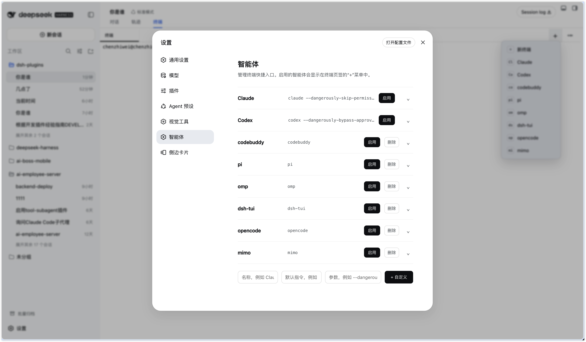
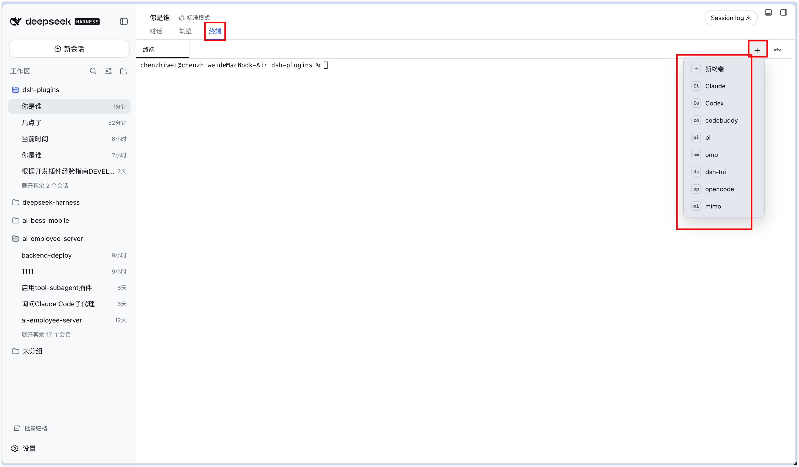
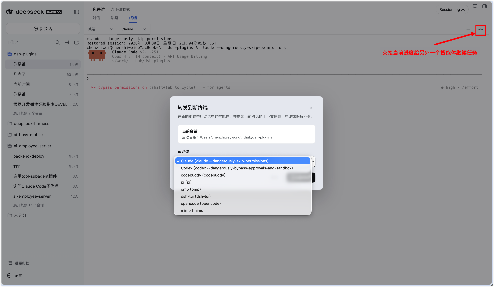

# dsh-plugin-terminal-agent · 终端智能体

在 DSH 会话中提供终端智能体面板，作为「对话」与「轨迹」之外的第三种会话形态。
打开后可以创建普通终端，也可以一键启动 Claude、Codex 等已配置的智能体并在新终端中继续工作。

插件通过 `conversation.view` 增量槽位添加页面，并直接加载 `dsh-better-sidebar` 提供的
`TerminalView`，因此复用其 xterm、PTY WebSocket、自动重连、终端主题和依赖诊断能力。

## 效果展示

### 在设置中管理终端智能体

在设置页的「智能体」中启用或停用终端智能体，也可添加自定义智能体命令。



### 在终端使用指定智能体

打开会话的「终端智能体」页签，点击 `+` 后可创建普通终端，或直接选择已启用的智能体。



### 交接给新的智能体

「转发到新终端」会携带当前会话上下文，并在新终端中启动选中的智能体继续任务，原终端保持不变。



## 功能

- 在「对话」和「轨迹」旁新增「终端智能体」页签
- 页签内提供二级终端标签栏，可同时管理多个独立终端
- 点击 `+` 菜单第一项「新终端」可创建空 shell；或在 Claude / Codex 等智能体项中创建带对应命令的终端，新终端会自动执行对应的 `claude` / `codex` 命令
- 设置页提供「智能体」菜单，可启用/禁用内置项，并分别配置名称、命令和启动参数
- 右上角「交接」可把当前会话交给已启用的另一智能体；完整 transcript 以只读文件保存，并附带原会话、工作目录和最近进展提示
- 双击二级终端标题可编辑；失焦或按 Enter 后保存，并在对应终端执行 `/rename 新标题`
- 每个会话拥有独立且可重连的终端进程
- 自动使用当前会话工作目录
- 明暗主题自动适配
- 首次打开终端时才加载 xterm 资源

## 安装方式

### 方式一：从 GitHub 在线安装

```bash
dsh plugin --profile web add github:<GitHub 用户名>/dsh-plugin-terminal-agent
dsh web
```

### 方式二：Git Clone 下载后安装

```bash
git clone https://github.com/<GitHub 用户名>/dsh-plugin-terminal-agent.git
cd dsh-plugin-terminal-agent
npm install
npm run build
dsh plugin --profile web add "$(pwd)"
dsh web
```

安装并重启后，进入任意会话；顶部出现「终端智能体」页签即表示插件已生效。

## 开发

```bash
npm install
npm run build
dsh plugin --profile web add 'link:/你的路径/dsh-plugin-terminal-agent'
dsh web
```

构建产物位于 `lib/`，发布时必须一并提交。

## 依赖与兼容性

- 依赖 `dsh-better-sidebar >= 0.14.0` 提供终端 Host 路由和原生 `TerminalView`
- `dsh-better-sidebar` 必须在同一 web profile 中启用；本插件不会重复挂载它，以避免终端 Host 路由冲突
- 使用当前 DSH rc.8 系列的 `conversation.view`、`modules` 与 session standard props 契约
